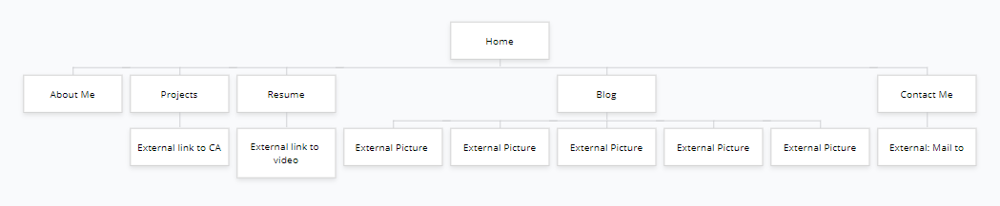

## This is my portfolio website. 
It was created to showcase my skills in web design as well as my personality. It's purpose is to help with future employment. 
It's made with simplicity in mind. Focusing on the main features and having them work well and showcase my photography with the backgrounds.
There is no URL or github link because we haven't learned to deploy yet and it should be noted that the SRI's hash was using the URL generated by the web preview in Ed.
This might mean the style sheet used to create the hash might have had code injected by Ed and the site can then only be viewd in Ed

# Features/Functionality include:

- Poppins sans-serif imported from google fonts.
- Nav bar that underlines the page you are on.
- Sleek social media icons that link to my profile pages on each page.
- Responsive design to view different layouts depending on screensize.
- Subresource Integrity to avoid tampering with my code.
- Contact me page that can open mail client with my e-mail.
- Background pictures with a blue overlay effect.
- Extra html pages for full size pictures for my blog.
- Links embedded into text on my resume and projects page.
- Cv.pdf linked on my resume page.

# Sitemap

The following is my sitemap showcasing the pages I created as well as the ones it links outside to.

# Thought Process

Below showcases my thought process, here is a mood board from pinterest

And here is a screenshot of my wireframe. For full wireframes of the site please refer to the slide deck presentation in the ppt/ folder as it contains all of them.
I am unable to add them as seperate files do to being at 100% of the user@sahara space (unable to even do my final commit).

Here is also an early draft of the website that was later scraped because i thought the design was too loud and wasn't as geared to my target audience.

# Target
My target audience is IT professionals, recruiters and perspective employers. It is my hope that the design, features and code displayed on this website will help land me future employment.

# Tech Stack
I used a tech stack which include HTML, CSS and git for version control.

### Thank you
